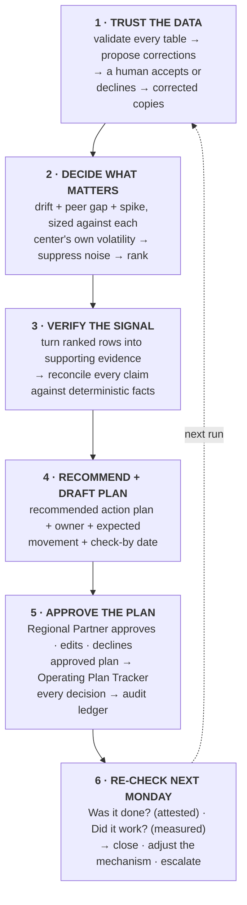

# Petfolk AI Strategy Lead Case Study — Lucas Richards

**Live demo:** [petfolk-monday-digest.vercel.app](https://petfolk-monday-digest.vercel.app)

**The Monday Digest.** A working version of Option A from the Case Study. 

> **Public candidate submission.** This is an unofficial case-study artifact, not
> a Petfolk production system. Petfolk names and trademarks belong to Petfolk.


## Data Insights: The action-plan status did not match the results

For 8 of the 10 existing action plans, the latest results did not support the on-track
status reported by Dr. Priya in the tracker. The following week’s data highlights why the system tracks two questions separately: 
1) Was the work completed? 2) Did the KPI actually improve?

- **Mount Pleasant, staff call-outs.** Weekly call-outs went 5.5 → 9, so the result was worse
  and nobody attested that the prior action plan was completed, so execution
  remains *unknown*.  Therefore, the existing Operating Tracker kept the issue open and asks the owner for an update.
- **Morrisville, records in 24h.** 78.1% → 79.5%. However, no one confirmed whether the action plan was completed, so the data currently the improvement without claiming the action caused it.


## What the 6-Stage Operating Loop Actually Does

This repo turns four raw operating tables into a weekly decision loop that empowers Dr. Priya to focus on critical priorities. It
validates the inputs, surfaces the few priorities that deserve attention, recommends
a specific action, routes it for approval, and returns the following week to check
separately whether the work happened and whether it worked.

The experience is designed for a thirty-minute Monday review. Fixed rules handle
every calculation and threshold. AI explains verified findings, drafts
recommendations, and answers leaders' questions.


---

## Run it locally

Requires Python 3 and Node.js 20+.

```bash
python3 -m venv .venv
.venv/bin/pip install pandas numpy pytest

cd app
npm install
npm run dev
```

Open [http://localhost:5173/admin](http://localhost:5173/admin), choose a Monday,
and run the pipeline. The four assessment CSVs are already included in
`DATA/INPUTS/`.

---

## How it works

### Execution path

```text
START
  ↓
validate_data()          ← deterministic Python
  ↓
human correction gate   ← pause/accept/decline
  ↓
score_signals()          ← deterministic Python
  ↓
analyze_signals()        ← LLM sees validation + signals
  ↓
harness_check()          ← deterministic Python
  ↓
load_prior_ledger()
  ↓
recheck_prior_actions()  ← deterministic evidence + LLM judgment where needed
  ↓
update_ledger()
  ↓
generate_digest()
  ↓
END
```

### Six-stage operating loop



**Production fit:** the case artifact uses its local ledger to prove the closed loop.
In Petfolk's live workflow, a generated action is a draft until the Regional Partner
approves or edits it; approved actions sync to the existing Operating Plan Tracker,
which remains the operational system of record. The ledger and append-only event log
preserve every decision and give the next Monday's run the context it needs to re-check
prior actions. A declined recommendation is logged, not treated as an active commitment.

The draft maps to Petfolk's existing action-plan fields without introducing a second
operating workflow:

| Existing tracker field | Production behavior |
|---|---|
| **Date of Entry** | Recommendation creation date |
| **Key Business Area** | KPI or operating category surfaced by the signal engine |
| **Status** | Human-managed workflow state after approval |
| **Team Member Responsible** | Proposed owner, confirmed or edited during approval |
| **Goal / Outcome** | Measurable KPI improvement goal |
| **Action Steps** | Grounded draft recommendation |
| **Potential Barriers** | Suggested only when supported by evidence; otherwise human-entered |
| **Resources** | Suggested only when supported by evidence; otherwise human-entered |
| **Expected Result** | Expected measurable KPI movement |
| **Progress Updates** | Human-entered evidence about whether the work was carried out |
| **Target Completion Date** | Check-by or due date |
| **Actual Completion Date** | Human-confirmed completion date |

**Production assumptions:** Business Partners and Partner Doctors remain responsible
for completing the fields and aligning the action plan; the Regional Partner remains
the approval step; and Partners and Regional Managers continue tracking progress,
status, and completion. The production integration can write approved plans to, and
read later updates from, the existing tracker; authentication and production
write-back are not simulated in this case artifact. Tracker updates provide
human-attested **execution** evidence, while the pipeline independently recomputes the
KPI **outcome** from operating data. If no execution update exists, execution remains
`unknown`: metric movement alone neither proves the work happened nor proves the
intervention caused it. Exam-room transcripts are assumed available, but are kept out
of the V1 deterministic priority score and would be used only as grounded context for
a surfaced signal.

Three layers, and the boundary between them is the design:

| layer | what it holds | AI |
|---|---|---|
| **Inputs** | the four raw CSVs, never edited | **Not allowed.** Source data is read, never written |
| **Translation** | validation, the corrections a human accepted, peer groups, the signal engine, the fact tables | **Not allowed.** Scoring math, thresholds and every metric calculation are Python |
| **Outputs** | the digest: verdicts, explanations, recommendation language, answers | **Allowed**, behind the trust boundary below |

**The trust boundary:** every number and every conclusion a model writes must
reconcile against the deterministic facts before it reaches a leader. What fails is
regenerated. What fails twice falls back to a deterministic sentence.

---

## What it decided on 2026-05-04

**21 data checks, 4 prior correction decisions carried forward, 0 new decisions
required.** Those prior decisions covered duplicate rows from a double-run of the
weekly load, negative wait times from a clock-sync bug, and maturity labels that
contradicted opening dates. Raw inputs are never edited; accepted corrections are
applied only to a working copy and reused consistently on the next run.

**3 signals surfaced from 121 center × metric combinations.** The new issue not
already covered above was Daniel Island, where the no-show rate reached 8.5% against
a 6.6% norm, worst of 12 new centers.

**4 more were held back and shown as held back.** Verdae CSAT looked like the worst
number on the page: 3.54/5 in the latest week. It was 7 responses. Pooled over 8
weeks it is 4.46/5 on 97 responses. The digest lists it, with the score it would
have reached on the naive read.

The complete plan-by-plan comparison is shown below.


---

## Reproduce the two-run result

After completing the local setup above, run the following commands from the repository
root:

```bash
.venv/bin/python -m pipeline.validate --as-of 2026-04-27 --accept all
.venv/bin/python -m pipeline.run --as-of 2026-04-27 --fresh-ledger
.venv/bin/python -m pipeline.validate --as-of 2026-05-04 --accept all
.venv/bin/python -m pipeline.run --as-of 2026-05-04
.venv/bin/python -m pytest                            # 216 tests
```

The original inputs and corrected working copies ship in `DATA/`, so the command-line
flow works after installation. No model key is required: with no LLM reachable, every
sentence falls back to a deterministic template and the numbers do not change. See
[`DATA/README.md`](DATA/README.md) for the data contract.

---

## How AI output is checked

Every AI-written conclusion is checked against the underlying numbers before it
reaches a leader. A below-baseline plan cannot be called "on track"; a plan that has
already reached its target should be closed; and an overdue plan with no recent
update is flagged for attention.

---

## Where to look

| | |
|---|---|
| [`docs/SCORING.md`](docs/SCORING.md) | every formula, window, weight and threshold, and the argument for each |
| [`docs/PIPELINE.md`](docs/PIPELINE.md) | the run end to end, module by module, plus the ledger contract |
| [`docs/LOOM_TRANSCRIPT.md`](docs/LOOM_TRANSCRIPT.md) | timestamped transcript of the submitted technical walkthrough |
| [`PROMPTS/`](PROMPTS/) | the prompts, loaded from disk at runtime. Editing one changes the next run |
| [`pipeline/harness.py`](pipeline/harness.py) | the number check and the rule table |
| [`tests/test_scoring.py`](tests/test_scoring.py) | known slow slides must be caught by drift and not by spike, and the reverse |
| [`app/README.md`](app/README.md) | the two views, the API, the transport |

---

## How I used AI

Started with four baseline CSVs and a brief.

Everything that is arithmetic is Python: cleaning, scoring, peer grouping,
suppression, plan facts. An LLM sits only where judgment and language belong, and
nothing it writes reaches a leader without passing the harness above. The model
ladder degrades on its own — Claude CLI, then the Anthropic API, then OpenAI over
plain HTTPS, then deterministic templates — and the UI names the tier that actually
wrote each sentence, so no model gets credit for text it did not write.

Built with AI-assisted coding tools. Each build phase was independently checked by
a second pass that recomputed the results, and a phase could not start until the
previous phase's numbers matched.

Tools: Claude Code · Codex · Anthropic and OpenAI APIs · pandas · numpy · pytest and
`node --test` · React · Vite · Express · Vercel · git.

---

## What I deliberately left out

I deliberately left production integrations out of the technical artifact: no live
Operating Plan Tracker write-back, practice management system, HRIS, client
communications, or production authentication and role permissions. I also kept
exam-room transcripts out of the V1 priority score and refused to infer that work
occurred from KPI movement alone.

The harder call was stopping at a complete, testable decision loop instead of adding
integrations that would look broader but could not be validated with the access and
data provided. I used the time to prove the core loop on real case data: validate,
prioritize, recommend, approve, remember, and re-check. The next production step is
two-way Operating Plan Tracker sync; transcript analysis follows once Petfolk defines
the first use case and how success will be measured.

---

## Dependencies

Two runtimes, no build step, nothing vendored.

**Python** — `pandas` (every table read and aggregation, verified on 3.0.5), `numpy`
(the scoring math, 2.5.2), `pytest` (tests only, 9.1.1). `anthropic` (0.122.0) is
optional and imported lazily by one LLM tier; without it the ladder still runs on
the Claude CLI, on OpenAI over plain HTTPS, or fully offline.

**Node ≥ 20** (built on 26.5.0) — `express` and `multer` for the API and CSV upload,
`ws` for the session socket, `react` / `react-dom` / `react-router-dom` for the two
views, `@vercel/analytics` for a page-view beacon on the deployed site only, and
`vite` / `@vitejs/plugin-react` / `concurrently` for dev and build.

Numbers are deterministic: same inputs, same figures, every run. The wording on top
of them is not, because a model writes it inside the harness's rule table. The app
computes nothing analytical, so a number on screen that the pipeline did not produce
is a bug in the app.
