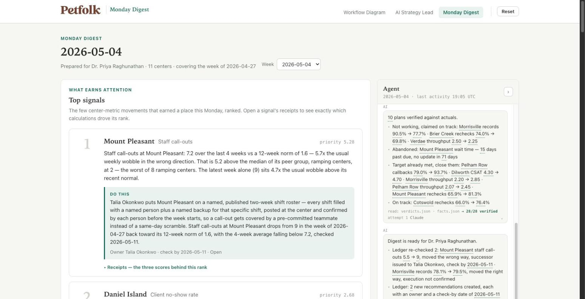
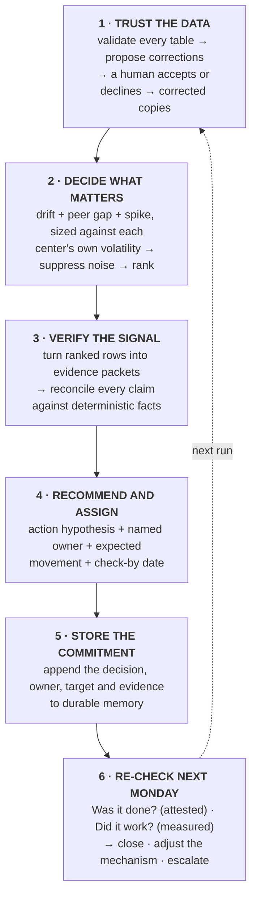
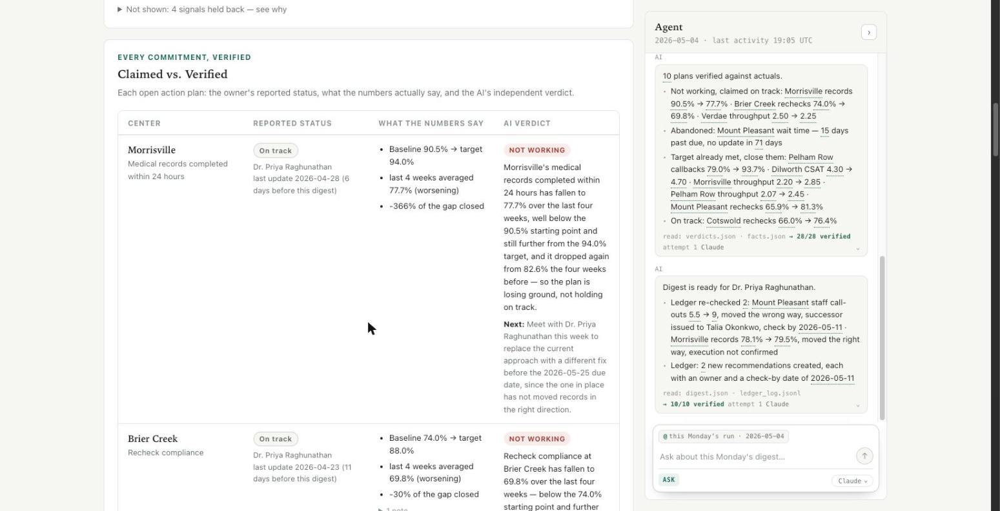

# Petfolk AI Strategy Lead Case Study — Lucas Richards

**The Monday Digest.** Option A of the brief. The prioritization layer is the engine
inside it.

> **Public candidate submission.** This is an unofficial case-study prototype, not
> a Petfolk production system. Petfolk names and trademarks belong to Petfolk. The
> assessment brief itself, generated run artifacts, local credentials, deployment
> linkage, and internal development instructions are intentionally excluded.

Dr. Priya Raghunathan is a Regional Medical Partner. She owns 11 of Petfolk's 47 Pet
Care Centers.

Today she gets a dashboard and a spreadsheet every Monday and gives them about thirty
minutes. Inside them are duplicate rows, impossible values, centers compared against
the wrong peer group, slow slides no weekly threshold catches, and action plans whose
reported status the numbers contradict.

I built a system that decides what earns those thirty minutes, says what to do about
it, and the following Monday checks whether it got done and whether it worked.



---

## The loop



Three layers, and the boundary between them is the design:

| layer | what it holds | AI |
|---|---|---|
| **Inputs** | the four raw CSVs, never edited | **Not allowed.** Source data is read, never written |
| **Translation** | validation, the corrections a human accepted, peer groups, the signal engine, the fact tables | **Not allowed.** Scoring math, thresholds and every metric calculation are Python |
| **Outputs** | the digest: verdicts, explanations, recommendation language, answers | **Allowed**, behind the trust boundary below |

**The trust boundary:** every number and every conclusion a model writes must
reconcile against the deterministic facts before it reaches a leader. What fails is
regenerated. What fails twice falls back to a deterministic sentence.

---

## What it decided on 2026-05-04

**21 data checks, 4 prior correction decisions carried forward, 0 new decisions
required.** Those prior decisions covered duplicate rows from a double-run of the
weekly load, negative wait times from a clock-sync bug, and maturity labels that
contradicted opening dates. Raw inputs are never edited; accepted corrections are
applied only to a working copy and reused consistently on the next run.

**3 signals out of 121 center × metric combinations.**

| | center | what moved |
|---|---|---|
| 1 | Mount Pleasant | staff call-outs 7.2 over 4 weeks against its own 12-week norm of 1.6, worst of 8 ramping centers |
| 2 | Daniel Island | no-show rate 8.5% against a 6.6% norm, worst of 12 new centers |
| 3 | Morrisville | records completed in 24h down to 77.7% from 87.7%, worst of 27 mature centers |

**4 more were held back and shown as held back.** Verdae CSAT looked like the worst
number on the page: 3.54/5 in the latest week. It was 7 responses. Pooled over 8
weeks it is 4.46/5 on 97 responses. The digest lists it, with the score it would
have reached on the naive read.

**10 action plans graded, every plan, every run.** 3 not working, 1 abandoned, 5
already past target and still open, 1 on track. **The AI disagreed with the owner's
self-reported status on 8 of 10.**



---

## Run it

**Hosted:** [petfolk-monday-digest.vercel.app](https://petfolk-monday-digest.vercel.app)
opens empty on purpose. Go to **AI Strategy Lead**, drop the four CSVs in, and the
digest gets built in front of you.

**The pipeline alone**, after placing the four assessment CSVs as described below:

```bash
python3 -m venv .venv && .venv/bin/pip install pandas numpy pytest
.venv/bin/python -m pipeline.validate --as-of 2026-04-27 --accept all
.venv/bin/python -m pipeline.run --as-of 2026-04-27 --fresh-ledger
.venv/bin/python -m pipeline.validate --as-of 2026-05-04 --accept all
.venv/bin/python -m pipeline.run --as-of 2026-05-04
.venv/bin/python -m pytest                            # 216 tests
```

**The app:** `cd app && npm install && npm run dev` → API on :4600, UI on :5173.

The original inputs and corrected working copies ship in `DATA/`, so the command-line
flow works after installation; the hosted demo still opens empty so a reviewer can
watch the system earn its conclusion from the four uploads. No model key is required:
with no LLM reachable, every sentence falls back to a deterministic template and the
numbers do not change. See [`DATA/README.md`](DATA/README.md) for the data contract.

---

## Two Mondays

Two real runs, one week apart. Nothing fabricated: the data ends at the week of
2026-04-27, so this is the only pair the data supports.

The 2026-04-27 run made two recommendations, each with a named owner and a check-by
date of 2026-05-04. The 2026-05-04 run opened with them:

- **Mount Pleasant, staff call-outs.** Call-outs went 5.5 → 9, so the outcome moved
  the wrong way. Nobody attested that the prior action was completed, so execution
  remains *unknown* and the digest asks the owner to confirm execution before
  changing the mechanism.
- **Morrisville, records in 24h.** 78.1% → 79.5%, moving the right way. Nobody
  attested that anything was done, so execution stays *unknown* and the row stays
  open. The digest credits the number, not the action.

The ledger is append-only and it is what the next run reads first.

---

## The harness

Every generated sentence goes through it before a leader sees it. Every
figure in it must exist in the fact table that was handed to the model, and a
deterministic rule table bounds the conclusion — below baseline can never be "on
track"; target already met must recommend closing; past due and untouched for 42+
days must be flagged abandoned. A failure regenerates with the complaint pasted
into the next attempt. A second failure falls back to the deterministic sentence.
Every check is logged, pass or fail.

On the 2026-05-04 run: **33 checks, 0 failures, 0 regenerations**. The run log and UI
identify the exact language tier used; the figures and verdict constraints are the
same whether the wording came from an available LLM or the deterministic fallback.

---

## Where to look

| | |
|---|---|
| [`docs/SCORING.md`](docs/SCORING.md) | every formula, window, weight and threshold, and the argument for each |
| [`docs/PIPELINE.md`](docs/PIPELINE.md) | the run end to end, module by module, plus the ledger contract |
| [`PROMPTS/`](PROMPTS/) | the prompts, loaded from disk at runtime. Editing one changes the next run |
| [`pipeline/harness.py`](pipeline/harness.py) | the number check and the rule table |
| [`tests/test_scoring.py`](tests/test_scoring.py) | known slow slides must be caught by drift and not by spike, and the reverse |
| [`app/README.md`](app/README.md) | the two views, the API, the transport |

---

## What it will not claim

**It cannot prove an action was performed.** Call-outs falling from 9 to 3 is not
evidence that anyone did the thing. Execution is attested by a person and defaults
to unknown. Outcome is measured. They are stored as two fields, and where nobody has
attested, the digest says so instead of inferring.

**It cannot prove cause.** The data shows Daniel Island's no-show rate is 8.5%
against a 6.6% norm and worst among its peers. It does not show that confirmation
outreach is why. Recommendations are labelled either evidence-backed, where
provider-level data shows the shape of the problem, or playbook, where the mechanism
is a standard first move. When a playbook move is executed and the number does not
respond, the ledger records that and the next run proposes a different mechanism.

---

## How I used AI

Started with four dirty CSVs and a brief.

Everything that is arithmetic is Python: cleaning, scoring, peer grouping,
suppression, plan facts. An LLM sits only where judgment and language belong, and
nothing it writes reaches a leader without passing the harness above. The model
ladder degrades on its own — Claude CLI, then the Anthropic API, then OpenAI over
plain HTTPS, then deterministic templates — and the UI names the tier that actually
wrote each sentence, so no model gets credit for text it did not write.

Built with AI-assisted coding tools. Each build phase was independently checked by
a second pass that recomputed the results, and a phase could not start until the
previous phase's numbers matched.

Tools: Claude Code · Codex · Anthropic and OpenAI APIs · pandas · numpy · pytest and
`node --test` · React · Vite · Express · Vercel · git.

---

## Dependencies

Two runtimes, no build step, nothing vendored.

**Python** — `pandas` (every table read and aggregation, verified on 3.0.5), `numpy`
(the scoring math, 2.5.2), `pytest` (tests only, 9.1.1). `anthropic` (0.122.0) is
optional and imported lazily by one LLM tier; without it the ladder still runs on
the Claude CLI, on OpenAI over plain HTTPS, or fully offline.

**Node ≥ 20** (built on 26.5.0) — `express` and `multer` for the API and CSV upload,
`ws` for the session socket, `react` / `react-dom` / `react-router-dom` for the two
views, `@vercel/analytics` for a page-view beacon on the deployed site only, and
`vite` / `@vitejs/plugin-react` / `concurrently` for dev and build.

No LLM SDK is required anywhere. The OpenAI tier is `urllib` and `fetch` against the
documented HTTP APIs.

Numbers are deterministic: same inputs, same figures, every run. The wording on top
of them is not, because a model writes it inside the harness's rule table. The app
computes nothing analytical, so a number on screen that the pipeline did not produce
is a bug in the app.
