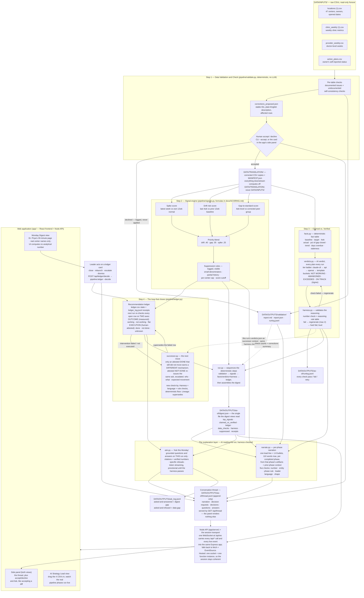

# PIPELINE — how a Monday digest gets made

A deterministic Python pipeline turns the four raw CSVs in `DATA/INPUTS/` into
Dr. Priya Raghunathan's Monday digest: what earns attention this week, a
**Claimed vs. Verified** check on every action plan, and a recommendation ledger
that re-checks itself the following Monday — handing her the next move when one
didn't work. The React + Node app in `app/` is the product surface: it runs the
real pipeline, narrates each phase in plain English, answers questions about the
run, and renders the digest. Every number on screen was written by
`pipeline/*.py`; neither the API nor the UI computes a single analytical number.

Scoring formulas live in [`SCORING.md`](SCORING.md) — this page is the route the
data takes, not the math.

---

## Quickstart — the pipeline alone

```bash
python3 -m venv .venv
.venv/bin/pip install pandas numpy pytest

.venv/bin/python -m pipeline.validate --as-of 2026-04-27 --accept all
.venv/bin/python -m pipeline.run --as-of 2026-04-27 --fresh-ledger
.venv/bin/python -m pipeline.validate --as-of 2026-05-04 --accept all
.venv/bin/python -m pipeline.run --as-of 2026-05-04
.venv/bin/python -m pytest                            # 216 tests after both runs exist
```

Sub-second per step on a laptop. The repository includes the four assessment inputs
and their corrected working copies but intentionally excludes generated run artifacts;
see [`DATA/README.md`](../DATA/README.md). The two `validate` commands read
`DATA/INPUTS/` (raw, never modified), propose corrections for human accept/decline,
and rebuild `DATA/TRANSLATION/`. If `DATA/TRANSLATION/` is missing, `pipeline.run`
stops and tells you to run them.

## Quickstart — the app (the way a reviewer should see it)

```bash
cd app && npm install
npm run dev          # API on :4600, Vite dev server on :5173 (proxies /api)
open http://localhost:5173
```

Single-port alternative: `npm run build && npm start` serves the built app and
the API together on http://localhost:4600. Requires Node >= 20. Full API
reference: [`../app/README.md`](../app/README.md).

- **`/` — Monday Digest**: Priya's page. Top signals with click-open score
  receipts, Claimed vs. Verified, the ledger, and the click-deep "Data checks:
  N ran, M corrections" strip.
- **`/admin` — AI Strategy Lead**: drag the 4 CSVs in, pick a Monday, run the
  real pipeline, watch the four phases execute on real events only.
- **The side panel (both views)** is the conversation: per-phase narration
  written by the LLM from that phase's artifacts, the corrections
  accept/decline card that the run **pauses** on until a human decides, and
  "Ask this Monday" — grounded Q&A with citations. It renders exclusively from
  `GET /api/thread` (persisted per Monday to `DATA/OUTPUTS/<asOf>/thread.jsonl`).
- **Ledger cards can be acted on**: close with credit / relaunch / escalate /
  dismiss with a reason, recorded through `pipeline.ledger --decide`. A failed
  re-check carries its **successor recommendation** as the headline.
- **Reset** (confirm-guarded) archives the Monday's thread, console and run
  artifacts into `DATA/OUTPUTS/<asOf>/thread_archive/` — nothing deleted — and
  rebuilds `DATA/TRANSLATION/` from `DATA/INPUTS/`, so the demo can run again
  from scratch.

**One transport, local and hosted.** The browser opens a single WebSocket at
`/api/ws` and sends every API call and every live event through it; the server
dispatches each one into the same Express app in-process. Hosted on Vercel this
is what keeps a session on ONE function instance — Fluid Compute otherwise
spreads a browser's requests across instances, and the run state, the ask queue
and the pipeline's `/tmp` working copy live on exactly one of them. Every HTTP
route (and `GET /api/ask/stream`) still works untouched, and the UI falls back
to `fetch` + `EventSource` if the socket cannot open. Protocol and the
measurements: [`../app/README.md`](../app/README.md#transport-one-session-one-server-apiws).

---

## The whole flow



---

## Walkthrough, stage by stage

1. **DATA/INPUTS/ (raw, read-only).** This holds the four deliberately dirty assessment CSVs,
   exactly as provided and never edited. The pipeline treats them like an external warehouse
   extract: if a number is wrong here, the fix happens downstream where it can be seen and
   reversed, never in place.

2. **Data Validation & Check (`pipeline/validate.py`).** Fully deterministic, no LLM. Runs
   first, one table at a time: locations → clinic weekly → provider weekly → action plans.
   Two kinds of checks per table: (a) every *documented* issue from the schema doc — duplicate
   rows, negative wait times, capitalization drift, the membership definition change — handled
   and counted; (b) *undocumented* self-consistency checks — maturity labels vs. actual opened
   dates, throughput vs. its own formula, clinic rollups vs. doctor-level data, plan baselines
   vs. what the metric actually was when the plan opened. Everything it finds lands in
   `DATA/OUTPUTS/validation/` as a plain-English report plus a machine-readable one.

3. **Accept / decline corrections (human decision).** The AI never silently edits data. Each
   proposed fix has a stable ID and a description; a human accepts or declines — from the CLI
   (`python -m pipeline.validate --accept all`, or a specific ID list) or, in the app, from the
   decision card in the side panel, where **the run pauses until someone decides** (unless it
   was started with `autoAccept`). Accepted fixes are applied to CSV **copies**; declined ones
   are logged and skipped. Either way there is a receipt, and the decision itself is posted to
   the thread.

4. **DATA/TRANSLATION/ (corrected copies + MANIFEST.json).** The corrected working set, with a manifest
   recording which corrections were accepted and row counts before/after. Every downstream
   step computes off `DATA/TRANSLATION/` — provenance is one file away, and `DATA/INPUTS/` stays pristine.

5. **Signal engine (`pipeline/signals.py`).** Decides what earns Priya's attention. Three
   *separate* direction-aware scores per center × metric — spike (this week vs. the center's
   own recent normal), drift risk (last 4 weeks vs. its longer baseline — the slow slides no
   weekly threshold catches), and gap-to-standard (its level vs. the corrected peer group).
   Blended into one priority score, ranked, then suppression rules apply (small denominators,
   partial history, per-center cap, score cutoff). Suppressed signals are listed with reasons
   — visible, not vanished. All formulas, windows, and weights: [`SCORING.md`](SCORING.md).

6. **Claimed vs. Verified (facts → LLM verdict → harness).** Every action plan, every run:
   - **Facts (`facts.py`)** — deterministic arithmetic per plan: baseline, target, 4-week
     actual, percent of gap closed, trend, days overdue, staleness. No LLM near this layer.
   - **LLM verdict (`verdicts.py`)** — gets the fact row plus the owner's Reported Status and
     independently rules: bucket (NOT WORKING · ABANDONED · EXCEEDED · ON TRACK, reading
     **Agree** when it matches the owner), one plain-English sentence, one recommended action.
     Four generation tiers, auto-detected best-first: `claude-cli` (pinned to Opus) → `api`
     (`ANTHROPIC_API_KEY`) → `openai` (`PETFOLK_OPENAI_API_KEY`) → deterministic template. All
     four pass through the harness identically, and the tier that actually wrote a sentence is
     recorded with it, so no model is credited for work it never did.
   - **Harness (`harness.py`)** — validates the reasoning, not just the numbers. Number check:
     every figure in the verdict must exist in the fact table, else regenerate (max 2) then
     hard fail, loudly. Reasoning rule table: below baseline can't be "on track"; target met
     must be acknowledged and closed; overdue + stale must flag abandonment. Every pass, fail,
     and retry goes to `DATA/OUTPUTS/<as-of>/runlog.jsonl`.

7. **Recommendation ledger (`pipeline/ledger.py`).** Every recommendation the digest makes
   becomes a tracked row — owner, expected metric movement, check-by date — plus an
   append-only receipts log. The next run re-checks every open row against the week that
   actually followed, and it answers **two separate questions** rather than one:

   - **Did the number move?** `working` · `not_working` · `flat` · `unverifiable` —
     deterministic arithmetic against the anchor the recommendation was created with.
   - **Was the work actually carried out?** `done` · `not_done` · `unknown` — **attested by a
     human, never inferred**, because a metric improving does not prove the team did the thing
     and a flat metric does not prove they ignored it. Until someone says, it is `unknown`, and
     the digest says so instead of guessing.

   A third field, `reading`, says whether the run has reached the row's own check-by date; an
   interim look can neither close a row nor escalate it. The three combine into a `loop_state`
   — the full contract is [below](#the-ledger-row-contract). This is the close-the-loop memory:
   run `--as-of 2026-04-27` then `--as-of 2026-05-04` and the second digest grades the first's
   recommendations against real data.

8. **Successor recommendations (`pipeline/successor.py`).** A failed re-check used to be a
   dead end — "rethink the fix" is an error message, not something a doctor can do on a
   Monday. It now generates a **successor**, but *which* successor depends on what is actually
   known:

   - **Attested done, and the number still went the wrong way by its own deadline** — the
     approach itself is falsified, so the next move is a **different mechanism**.
   - **Attested not done** — the original ask was never tested, so inventing a new fix would
     answer a question nobody asked. The **same ask** is re-issued, escalated to both regional
     partners.
   - **Nobody has attested** — no successor at all. The system asks the owner whether it
     happened before it changes anything.

   Whichever it is, it carries an accountable owner by name, the number that should move, and a
   new check-by date. It is generated on the same tier ladder and must pass three checks — numbers
   in the context, leader language, and a rule check that rejects restatements and dead-end
   verbs — with a deterministic successor as the floor. The failed row is marked superseded,
   so lineage is recorded rather than overwritten.

9. **Per-phase narration (`pipeline/narrate.py`).** While the run is still going, each
   completed phase gets one lead line and a few bullets for a non-engineer — what was DECIDED
   or FLAGGED, with the center, the metric and the numbers, never how the machine worked —
   generated only from that phase's real artifacts plus a deterministic trimmed block of the
   prior phases' results (context is fed into the prompt, never model memory). Same tier
   ladder; every bubble passes five checks against those artifacts: the number check, an
   entity check (every proper name is a center the run really names), a per-phase rule check
   (every ranked signal's center is named and no suppressed-only one is; no plan is filed
   under a bucket the verdict table did not give it), a leader-language check (no internal
   IDs, no raw metric ids, never "audit", no process narration, no editorial adjectives), and
   a shape check (lead line, 1–8 bullets, ≤110 words). The deterministic template is the
   fallback, so a phase is never left silent and never narrated with an unverified number.
   Every number, date and center name that passed is emitted as a **receipt** — `{token,
   path, field, value}` — so the panel can underline it and a reviewer can follow it back to
   the exact field by hand. Check receipts go to `DATA/OUTPUTS/<as-of>/narrate_runlog.jsonl` — its
   own log, because the verdicts step is still writing `runlog.jsonl` at the time. The app
   spawns it per phase and posts the result into the thread.

10. **"Ask this Monday" (`pipeline/ask.py`).** Grounded Q&A whose entire world is this run's
    artifacts: the validation report, signals, facts, verdicts, digest, that run's ledger
    events, and the center-name mapping. Every answer cites its receipts, carries a
    verified-numbers count from `harness.check_numbers_pool`, and **refuses specifically**
    — naming the missing data — when the artifacts can't ground it. A hard harness failure
    becomes an honest refusal pointing at the receipts, never a fabricated answer. Answers can
    stream token by token (`--stream`), but streamed text is provisional: it is discarded and
    regenerated if a number fails to verify, and only the validated payload is persisted.
    Every question, answered or refused, is appended to `DATA/OUTPUTS/ask_log.jsonl` —
    asked-and-answered is a digest gap, asked-and-refused is a data gap.

11. **The thread is the conversation surface.** Narration entries, the corrections decision
    request, the decisions themselves, questions and answers all land in one append-only
    `DATA/OUTPUTS/<as-of>/thread.jsonl`, served by `GET /api/thread`. The side panel renders that
    and nothing else, so a reload — or a second browser — sees the same truth, and any future
    client (Slack, email, a hosted deploy) can consume the same API. A re-run rotates the
    previous thread into `DATA/OUTPUTS/<as-of>/thread_archive/`: a run's story is never mixed with
    the last one's, and nothing is deleted.

12. **digest.json → web application → back into the ledger.** `pipeline/run.py` sequences the
    deterministic steps and assembles `DATA/OUTPUTS/<as-of>/digest.json` — top signals, Claimed vs.
    Verified, ledger, the "Data checks: N ran, M corrections" line, harness stats, the
    suppressed list, and receipt paths. The web app (`app/`: React frontend, Node API) renders
    it in two views and computes no analytical number of its own; in the browser every one of
    those API calls and every live event travels one WebSocket at `/api/ws`, which falls back
    to `fetch` + `EventSource` and, hosted, is what keeps a session on one function instance
    (`app/README.md` → Transport). And the flow closes: from a ledger card the leader
    can close with credit, relaunch with a new date, escalate, or dismiss with a reason —
    `POST /api/ledger/decide` runs the pipeline's own `--decide` machinery, so the decision
    becomes a receipt in `ledger_log.jsonl` and an entry in the thread, and the next run's
    memory starts from it.

---

## Close the loop (two real runs, no fabrication)

```bash
.venv/bin/python -m pipeline.run --as-of 2026-04-27 --fresh-ledger
.venv/bin/python -m pipeline.run --as-of 2026-05-04
```

The second run re-checks the first run's recommendations against the real week
that followed, and answers **two separate questions** about each: did the number
move, and did the work actually happen? The first is measured. The second is
**attested by a human and never inferred** — a metric improving does not prove
the team did the thing.

So the two re-checks land differently. Mount Pleasant was attested done by its
owner and the number still went the wrong way, which falsifies the approach
itself — that row is **superseded by a successor**: a different mechanism, a
named owner, a new check-by date. Morrisville moved the right way but nobody has
confirmed the recommended work happened, so the gain is credited to the center
**without being claimed as this recommendation's result**, and the row stays
open. Attest it and the next run closes it with credit.

Escalation follows an attested "not done", never a number that sat still. An
interim reading — before a row's own check-by date — can neither close a row nor
escalate it. Re-running the same Monday is idempotent: the ledger replays stored
outcomes rather than double-escalating. The figures behind each verdict
come from the run itself (`DATA/OUTPUTS/ledger.csv`, `ledger_log.jsonl`) — this doc
deliberately doesn't copy them.

---

## The modules

| Module | What it does |
|---|---|
| `pipeline/config.py` | Paths, the as-of Monday, the metric registry (bad direction, formatting, tolerances) |
| `pipeline/validate.py` | Step 1 — Data Validation & Check. Deterministic; proposes corrections, never applies silently |
| `pipeline/signals.py` | Step 2 — spike / drift risk / gap-to-standard, three separate scores, then suppression rules that are logged |
| `pipeline/facts.py` | Step 3a — the deterministic fact table behind every action plan |
| `pipeline/verdicts.py` | Step 3b — Claimed vs. Verified: the AI verdict on every plan, every run |
| `pipeline/harness.py` | The check every generated sentence passes: numbers must exist in the facts, a rule table bounds conclusions, everything logged |
| `pipeline/ledger.py` | Step 3c — the recommendation ledger: state table + append-only receipts, re-checked next run |
| `pipeline/successor.py` | The next move after a recommendation failed or was ignored — falsifiable, lineage recorded |
| `pipeline/narrate.py` | Per-phase plain-English narration for the app's panel, from that run's artifacts only |
| `pipeline/ask.py` | "Ask this Monday" — grounded Q&A on one run, with citations, refusals, and `--stream` |
| `pipeline/run.py` | Sequences all of it and assembles `DATA/OUTPUTS/<as-of>/digest.json` |

**The three-layer harness in one line:** deterministic facts are computed
first, the LLM only judges on top of them, and `pipeline/harness.py` rejects
any output whose numbers aren't in the fact table or whose conclusion breaks
the reasoning rule table — every pass/fail/retry logged (`runlog.jsonl`,
`narrate_runlog.jsonl`, `ask_log.jsonl`).

---

## LLM modes

Verdicts, narration, successors and answers all use the same tier ladder,
auto-detected best-first and overridable with `--llm-mode`:

1. **claude-cli** — the Claude Code CLI on PATH (`claude -p`, headless).
   Pinned to **Opus** (`CLI_MODEL`, override with `PETFOLK_CLI_MODEL`).
2. **api** — `ANTHROPIC_API_KEY` set; Anthropic SDK, model `claude-opus-5`.
3. **openai** — `PETFOLK_OPENAI_API_KEY` (or `OPENAI_API_KEY`) set; plain
   HTTPS, model `gpt-5.1` by default. A different vendor, labelled as itself
   everywhere — never as Claude.
4. **template** — none of the above: deterministic sentences built from the
   fact table.

All four pass through the same harness checks; nothing is validated more
loosely in any mode. A model that never answers is a **transport** failure —
the ladder degrades one rung and says so (`decided_by`, `fallbacks`); a model
that answers wrongly is a **content** failure and regenerates. With no CLI and
no key the pipeline still runs end to end offline, and `digest.json` records
which tier produced it (`harness.mode`).

The prompts themselves are not documentation — they are the runtime code path,
loaded from [`../PROMPTS/`](../PROMPTS/) on every call.

---

## The ledger row contract

One field, one concept. Deterministic arithmetic is never allowed to make a
claim about human behavior. This is the shape that replaced a single `status`
column which had collapsed lifecycle, measured outcome, and an inferred claim
about whether a human acted — so arithmetic could silently overwrite a person's
attestation, and a flat metric could be reported to a leader as "nobody acted".

- **`outcome` is computed.** Deterministic arithmetic.
- **`execution` is attested by a human.** Never inferred; defaults to `unknown`
  — the system says "we don't know" rather than guessing.
- **`status` is lifecycle only.** It carries no measurement claim.
- **`reading` is timing.** Where the run sits relative to the row's own check-by.

### `DATA/OUTPUTS/ledger.csv` columns

Identity and content: `rec_id` · `created_week` · `location_id` ·
`location_name` · `metric` · `recommendation` · `owner` · `expected_direction` ·
`check_by` · `last_checked` · `outcome_note` · `escalation_level` ·
`supersedes` · `superseded_by` · `decision`

| column | source | values | default |
|---|---|---|---|
| `status` | lifecycle | `open` · `closed` · `dismissed` · `escalated` · `superseded` | `open` |
| `execution` | **human attestation only** | `done` · `not_done` · `unknown` | `unknown` |
| `execution_by` | actor name | free text | `""` |
| `execution_at` | ISO 8601 timestamp | | `""` |
| `outcome` | deterministic arithmetic | `pending` · `working` · `not_working` · `flat` · `unverifiable` | `pending` |
| `reading` | `as_of` vs `check_by` | `pending` · `interim` · `due` · `overdue` | `pending` |
| `action_basis` | deterministic, from `provider_grounding()` | `measured` (provider-level data shows the SHAPE of the problem) · `playbook` (standard first move, mechanism unproven) | — |
| `action_assumption` | templated from `action_basis` | free text | `""` |

**`action_assumption` is a sibling field. It is NEVER concatenated into
`recommendation`** — the tests assert exact string equality on `recommendation`,
`check_rules.different_from_what_failed` substring-matches it, and
`PROMPTS/next-move.md` mandates a strict three-line model output.

### `outcome` — computed

`toward` = movement in the direction the recommendation wanted;
`floor` = `SCALE_FLOORS[metric.kind]`, the noise floor.

| condition | outcome |
|---|---|
| row not yet re-checked | `pending` |
| anchor or follow-up level missing | `unverifiable` |
| `toward >= floor` | `working` |
| `toward <= -floor` | `not_working` |
| otherwise (inside the floor) | `flat` |

`flat` describes the number, not the person. There is deliberately no outcome
value meaning "ignored" — arithmetic cannot see intent.

### `reading` — computed from `as_of` vs the row's own `check_by`

| condition | reading |
|---|---|
| never re-checked | `pending` |
| `as_of < check_by` | `interim` |
| `as_of == check_by` | `due` |
| `as_of > check_by` | `overdue` |

A row is **mature** when `reading in ("due", "overdue")`.

### `execution` — attested only

Set exclusively by `record_human_decision(..., action="attest", execution=…)`.
No code path may infer it from a metric. Default `unknown`.

### `loop_state` — derived on read, never stored

| execution | outcome | mature? | `loop_state` | display | consequence |
|---|---|---|---|---|---|
| any | `pending` | — | `pending` | Open — awaiting first re-check | carry |
| any | `unverifiable` | — | `unverifiable` | Can't verify — no usable data | carry, name the gap |
| `done` | `working` | yes | `confirmed_working` | Done, and it worked — closing with credit | **close** |
| `done` | `working` | no | `in_flight` | Done — early signs good, checking {check_by} | carry |
| `done` | `not_working`/`flat` | yes | `intervention_failed` | Done, and it didn't work — next move ready | **successor: a different mechanism** |
| `done` | `not_working`/`flat` | no | `in_flight` | Done — too early to tell, checking {check_by} | carry |
| `not_done` | any | — | `not_executed` | Not done — {owner} owes an answer | **escalate; re-issue the SAME ask** |
| `unknown` | `working` | — | `unattributed_gain` | Moved the right way — not confirmed anyone acted | credit the center, ask who/what |
| `unknown` | `not_working`/`flat` | yes | `needs_attestation` | Was this tried? — answer before we change the fix | **ask; no new mechanism** |
| `unknown` | `not_working`/`flat` | no | `awaiting_evidence` | Too early — checking {check_by} | carry |

### Invariants

1. **Only `loop_state == "intervention_failed"` produces a different-mechanism
   successor.** `not_executed` re-issues the original ask with a harder owner;
   `needs_attestation` produces no successor at all.
2. **`reading == "interim"` may not close a row and may not escalate it.**
3. **A row closes only via `confirmed_working` or an explicit human decision.**
   Outcome alone never closes anything.
4. **`escalation_level` increments on `not_executed` only** — never because a
   number failed to move.

### Human decision actions

`attest` is the only action that writes `execution`, and unlike the others it
does **not** change `status`.

| action | writes | requires |
|---|---|---|
| `attest` | `execution`, `execution_by`, `execution_at` | `--execution done\|not_done` |
| `close` | `status = closed` | — |
| `relaunch` | `status = open`, new `check_by`, clears `last_checked` | `--check-by` |
| `escalate` | `status = escalated` | — |
| `dismiss` | `status = dismissed` | `--note` |

```bash
python -m pipeline.ledger --decide REC-… --action attest --execution done --by "Talia Okonkwo"
```

Logged as a `human_decision` event carrying `execution_before` and `execution`.

### Counts keys (`digest.ledger.counts`)

`narrate.py` resolves receipt provenance by **leaf word**, so the literal token
`working` must remain inside the key names — `outcome_working` /
`outcome_not_working`, never `credited` / `failed`.

```
rows_total · open · rechecked · created · successors
outcome_working · outcome_not_working · outcome_flat
execution_done · execution_not_done · execution_unknown
```

### Whitelist gate

`_open_row_json()` in `pipeline/ledger.py` is an explicit field whitelist. **A
new column that is not added there never reaches digest.json or the UI.** The
same applies to `app/server/lib/partial-digest.js`, which builds a different
fallback shape (`{partial, note, rows}`) straight off the CSV.

---

## Environment

Python 3.14 with pandas 3.0.5 and numpy 2.5.2; `pytest` for the suite. The
`anthropic` SDK is optional — imported lazily, and only by the `api` tier. Node
>= 20 for the app. The full list, with what each package is for, is in the root
[README](../README.md#everything-it-depends-on). Keys may live in a gitignored
`.env.local` at the repo root; a real environment variable always wins.
